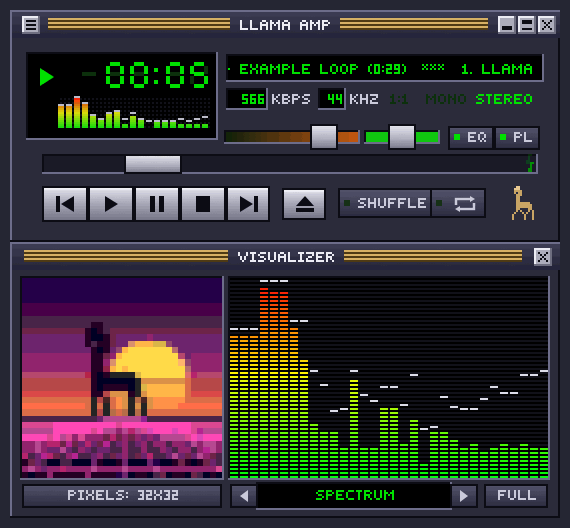
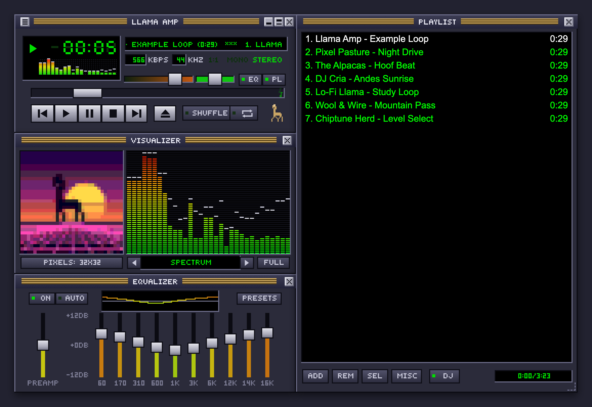
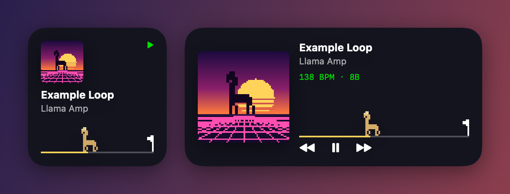

# Llama Amp for macOS

  

A native AppKit music player with a classic 2.x-style skin: LCD time display, mini spectrum,
pixelated cover art, eight visualizers (with fullscreen), a 10-band EQ with presets and a
drag-and-drop playlist that is remembered between launches.

Llama Amp is an independent project, not affiliated with Winamp or Llama Group SA (Winamp is their trademark). It
contains no Winamp code, graphics or sounds: the built-in look is drawn from scratch, the startup jingle and example
loop are synthesized by the app, and classic `.wsz` skins are loaded only when you choose them.

## Features

- **Classic look**: LCD time, scrolling marquee, mini spectrum, windowshade mode, snapping windows, three sizes,
  and real classic Winamp `.wsz` skins with a built-in browser for the Winamp Skin Museum.
- **Sound quality**: bit-perfect output (the device follows each song's sample rate; a **1:1** light tells you when
  nothing changes the sound), gapless playback, ReplayGain / loudness levelling, output device and AirPlay picker.
- **EQ**: 10 bands with presets, Auto EQ that adapts to each song, per-song memory, Winamp `.eqf` import/export.
- **DJ mixing**: beat-matched, key-aware transitions with echo-outs, a live two-deck waveform view,
  **Harmonic Next** (picks the next song by key and tempo) and one-click DJ-set ordering.
- **Visuals**: eight pixel visualizers, **MilkDrop** with 360+ presets, fullscreen, pixelated cover art and a
  dancing llama.
- **Synced lyrics**, karaoke-style, from `.lrc` files, the song's own tags or LRCLIB.
- **Library**: music library with play counts, a tag and cover editor (MP3, FLAC, M4A), jump to file.
- **Mac integration**: a [desktop widget](#desktop-widget) (now playing, a llama walking to the end of the song,
  playback buttons), a menu-bar controller, a Dock icon where the llama walks too, media keys and Control Center.

## Install

1. Download `Llama-Amp-<version>.dmg` from the
   [Releases page](https://github.com/mahardikazarhankristanto-ship-it/llama-amp/releases).
2. Open it and drag **Llama Amp** onto **Applications**.
3. The first time you open it, macOS warns that it can't verify the developer (the app isn't signed with a paid
   Apple Developer ID). To allow it once:
   - **macOS 15 Sequoia and later:** open the app, click **Done**, then go to **System Settings → Privacy &
     Security**, find "Llama Amp was blocked…" and click **Open Anyway**.
   - **macOS 14 Sonoma:** right-click Llama Amp in Applications, choose **Open**, then **Open** again.
   - Or in Terminal: `xattr -dr com.apple.quarantine "/Applications/Llama Amp.app"`

Requires macOS 14 or later; runs natively on Apple silicon and Intel Macs.

## Build

Needs only the Swift command-line tools (macOS 14+, Apple silicon):

    ./build.sh

The app lands in `build/Llama Amp.app` (1.7 MB). Drag it to /Applications to keep it. The release build drops
unused code and symbols (kept in `build/LlamaAmp.dSYM` for reading crash reports) and ships MilkDrop's scripts
xz-compressed (2.2 MB → 0.27 MB, unpacked as the page loads).

    ./make-dmg.sh

builds the universal app (Apple silicon + Intel) and packs it into `build/Llama-Amp-<version>.dmg` for a release.

    DEV=1 ./build.sh

builds `build/dev/Llama Amp.app` with the test modes compiled in (`--audiotest [--bugs] [--live]`,
`--featuretest <dir>`, `--djtest`, `--djloop [n]`, `--uitest <dir>`, `--readmeshots <dir>`, `--perf`, `--visbench`, `--snapshot <dir>`). Test modes never save
settings and never change the output device's volume or sample rate beyond the test itself.

The README pictures are made by the app itself: `--readmeshots docs` (developer build) writes `screenshot.png` and
`demo.gif`, and `Tools/WidgetShot` draws the widget (`swiftc -D WIDGET_PREVIEW Tools/WidgetShot/main.swift
Widget/LlamaWidget.swift Sources/PixelBuffer.swift Sources/Covers.swift -o build/widgetshot && build/widgetshot docs/widget.png`).

## Keys

Z prev · X play · C pause · V stop · B next · L open · ←/→ seek · ↑/↓ volume ·
S shuffle · R repeat · J jump to file · N mix into next track · M next visual · F fullscreen visual ·
Y lyrics · H harmonic next · P next MilkDrop preset · Delete remove · Return play selected

## Windows

The player, visualizer, equalizer and playlist are separate windows that snap to each other and to screen
edges. Dragging the player moves everything docked to it; dragging any other window detaches it.
Double-click a title bar to collapse it to a strip (windowshade). Drag the playlist's bottom-right corner to resize.

## Library, file info, EQ presets

- **Media Library** (⌘L): scans `~/Music` (add more under Folders…), browse by artist/album/genre, Recently Added,
  Most/Recently Played, search, sort by BPM or key. Double-click plays the shown list; drag songs onto the playlist.
- **File Info** (⌘I, clutter bar "I", playlist right-click): edit title/artist/album/year/genre/track/comment and the
  cover for MP3, FLAC and M4A. Writes go to a temp copy that must decode to the same length before it replaces the file;
  untouched frames/comments are kept.
- **EQ presets**: save your own, import/export Winamp `.eqf` (or a whole `winamp.q1`), optional per-song EQ memory.

## Desktop widget

Right-click the desktop → Edit Widgets → search "Llama Amp" (small and medium sizes). The llama walks to the end of
the song; the medium widget's buttons open `llamaamp://prev|playpause|next`. Built with the command-line tools only,
so the buttons are links into the app rather than background App Intents.

## Winamp skins

Classic Winamp 2.x skins (`.wsz`) are supported: drop one on any window, open it from Finder, or use
Options → Skins → Load Skin…. Loaded skins are copied to `~/Library/Application Support/LlamaAmp/Skins` and listed in
the Skins menu. Main window, equalizer and playlist are drawn from the skin's bitmaps (including VISCOLOR.TXT and
PLEDIT.TXT); the visualizer window, which classic skins don't cover, is tinted to match. Modern `.wal` skins aren't supported.
Thousands of classic skins: https://skins.webamp.org

## DJ mixing

With DJ Mix on (playlist DJ button, or Playback → DJ Mixing), each track's tempo and beat grid are detected in the
background. Near the end of a song the next one is tempo-matched without changing pitch, started on a downbeat,
faded in with its bass cut, the basslines are swapped halfway, and the new track then eases back to its own tempo.
Tracks more than 8% apart in tempo get an echo-out (or a crossfade). Keys are detected (Camelot codes; harmonic pitch-class profile with drum removal and tuning
estimation, matched against profiles learned from the GiantSteps Key dataset: 59.6 % exact / 67.5 % MIREX-weighted /
74.7 % harmonically compatible in 5-fold cross-validation; uncertain keys are shown with "?") and clashing
keys get a short 8-beat overlap; loudness is levelled around -10 LUFS. "Order Playlist for a DJ Set" arranges the
playlist by tempo, key and energy. Analyses are cached in `analysis.json`.

Menu shortcuts: ⌘O open, ⇧⌘O add folder, ⌘1/2/3 toggle visualizer/EQ/playlist, ⌘F fullscreen
visualizer, ⌘-/⌘0/⌘= window size. Media keys and Control Center Now Playing work too.

## Sound quality and listening

- **Bit-perfect mode** (Playback → Audio Output, on by default): the decoded samples reach the output device unchanged.
  EQ, Auto EQ, volume leveling, balance and DJ mixing are switched off (and come back when the mode is turned off,
  or when one of them is switched on); the DJ's time-stretch units leave the audio chain (even bypassed they round
  samples); the volume slider drives the device's own volume; and the device is switched to each song's sample rate
  (and its deepest bit depth) before it plays. The Audio Output menu says whether the current song is bit-perfect
  and, if not, why. Bluetooth headphones (AirPods etc.) can't be: the Bluetooth link re-encodes audio as AAC/SBC.
  Wired earphones, USB-C earphones and USB DACs can. Device rates are restored when the app quits.
- **The 1:1 light** between kHz and MONO in the main window lights while the song reaches the device bit-perfect;
  its tooltip says why when it doesn't, and clicking it opens Audio Output.
- **Match sample rate** (on by default, also outside bit-perfect mode): no resampling inside the app.
- **Gapless playback**: the next song is queued on the same player, so it starts on the sample after the last one
  (songs of the same sample rate; a song at another rate starts after the device switches, about 0.4 s).
- **Volume leveling**: per song or per album, using ReplayGain tags (FLAC Vorbis comments, MP3 TXXX, M4A freeform)
  shifted to the -10 LUFS target and never past the recorded peak; songs without tags use the measured loudness.
- **Output device**: System Default (follows it) or any device; AirPlay receivers appear under the AirPlay device.
- **Synced lyrics** (Y or ⌘Y) scroll karaoke-style over the visualizer window (and fullscreen): an `.lrc` file next to
  the song, lyrics inside the file (FLAC LYRICS, MP3 SYLT/USLT, M4A), or LRCLIB (lrclib.net; sends artist, title,
  album and length; cached in `Lyrics/`; turn off with View → Find Lyrics Online).
- `--audiotest` (developer build) checks all of this offline (bit-exact output for 16- and 24-bit FLAC, gapless joins, tag and LRC
  parsing, leveling math); add `--live` to check, muted, that the real device follows 44.1 → 96 kHz.

## Harmonic Next, DJ decks, MilkDrop

- **Harmonic Next** (H, Playback menu): instead of list order, the next song is the unplayed one that follows best:
  closest tempo (half/double time counts), compatible Camelot key, similar loudness. Songs aren't repeated until all
  have played; Previous walks back through what actually played. Works with gapless playback and DJ mixing.
- **DJ decks**: while a mix is coming up or running, the visualizer window shows both decks' 3-band waveforms
  (blue lows, orange mids, white highs) scrolling past a playhead, with beat ticks (red = downbeat) that line up when
  the mix is beat-matched; fades dim a deck and the bass swap shows as the lows leaving one deck. Also a visualizer
  mode of its own ("DJ DECKS"); turn the automatic view off under DJ Mixing → Show Waveforms During Mixes.
- **MilkDrop**: real MilkDrop presets (Butterchurn, MIT, bundled with 360+ presets from its packs) in the
  visualizer window and fullscreen; a new random preset every 20 s with a blend (lock it in Visualization), click or P
  for the next one. Lyrics show on top. It is fed the app's own waveform and renders only while on screen, but it is
  the heaviest visual: roughly 35–55 % of one core across the app and WebKit's helpers while showing.
- Playback logic (DJ automation, EQ glides, gapless queueing) runs on its own timer, so mixes happen even when the
  windows are covered or the screen is asleep. `--featuretest <dir>` checks all of the above.

## Privacy

Llama Amp has no accounts, analytics or tracking. It goes online only for:

- **Lyrics** (on by default; View → Find Lyrics Online turns it off): the artist, title, album and length of the
  song that's playing are sent to lrclib.net. Results are cached in `~/Library/Application Support/LlamaAmp/Lyrics`.
- **The Skin Browser**, only while you use it: your search text goes to the Winamp Skin Museum (api.webamp.org),
  and the skins you pick are downloaded from it.
- **The desktop widget** reads a small now-playing file the app writes; nothing leaves the Mac.

## License and credits

MIT — see `LICENSE`. The MilkDrop visualizer uses Butterchurn and its presets (MIT); the key profiles were derived
from the GiantSteps Key data set (Knees et al., ISMIR 2015), which isn't included. Details in
`THIRD_PARTY_NOTICES.md`.

## Performance

- Frame rate adapts: 30 fps only while music plays and a visualizer is on screen (60 with View → Visualization →
  Smooth Visuals), about 12 fps otherwise; covered or minimised windows aren't drawn at all.
- Each frame repaints only what changed (time digits, marquee, seek thumb); the visualizers and the dancing llama
  live in their own layers, so a new visualizer frame never repaints the window around it.
- The audio engine pauses when playback is paused or stopped; the audio-thread analyzer allocates nothing per callback.
- Measured on this Mac (share of one core): stopped ≈1.7 %, paused ≈1.8 %, playing with all windows visible ≈12 %,
  playing with windows hidden ≈3.4 % (was 22 % / 26 % / 27–38 % before). Every visualizer renders in ≤0.22 ms per frame.
- `build/perf.sh <label> [ENV=…]` measures CPU time and memory in perf mode; `--visbench` times each visualizer.

## Layout

- `Sources/AudioEngine.swift` – AVAudioEngine graph (decks → 10-band EQ → balance), gapless queueing, rate switching
- `Sources/Output.swift` – CoreAudio devices: sample rate, bit depth, hardware volume, AirPlay sources
- `Sources/Lyrics.swift` – LRC/embedded/LRCLIB lyrics and the scrolling overlay
- `Sources/Waveform.swift` – 3-band waveforms and the DJ decks view
- `Sources/Milkdrop.swift`, `Resources/milkdrop/` – MilkDrop via Butterchurn in a web view
- `Sources/Player.swift` – playback, playlist, settings, Now Playing
- `Sources/Library.swift` – tags/artwork loading and the synthesized example loop
- `Sources/Visualizers.swift` – all visualizers, drawn into small pixel buffers
- `Sources/BeatGrid.swift`, `Sources/DJMixer.swift` – tempo/beat detection and the two-deck mixer
- `Sources/Windows.swift` – snapping windows, windowshade, keyboard shortcuts
- `Sources/JumpPanel.swift`, `Sources/StatusMenu.swift` – jump to file, menu bar/Dock controls, startup sound
- `Sources/TrackAnalysis.swift` – key detection, loudness, analysis cache; `Sources/TagIO.swift` – tag reading/writing
- `Sources/MediaLibrary.swift`, `Sources/LibraryWindow.swift`, `Sources/FileInfoWindow.swift`, `Sources/SkinBrowser.swift`, `Sources/EQPresets.swift`
- `Widget/` – the WidgetKit extension; `Sources/WidgetBridge.swift` feeds it

Key benchmark: `Tools/KeyBench` (`keybench <GiantSteps dir>`; `ONLY=`, `EXPORT=`, `CONF=1` options). The data set
isn't included (its audio is Beatport's); download it with the scripts at
https://github.com/GiantSteps/giantsteps-key-dataset.
Dev aids: `--uitest <dir>` captures the library, file info and skin browser windows; `--snapshot <dir>` writes window PNGs; `--djtest` plays real transitions muted and logs beat alignment;
`Tools/TestSkin` builds a synthetic skin with one colour per sprite, and `--skintest <wsz> <dir>` + `checkskin` verify every sprite lands where Winamp puts it.
- `Sources/*Panel.swift` – the four skinned sections; `RootView.swift` lays them out
